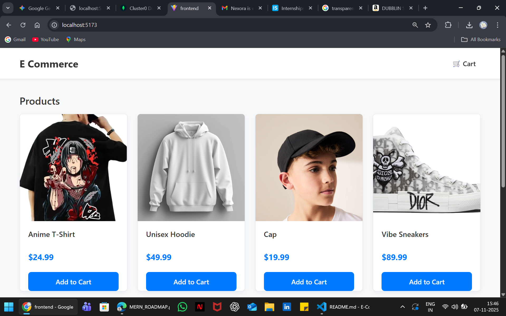
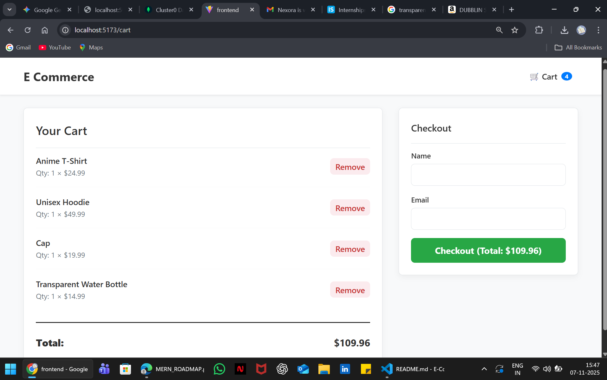
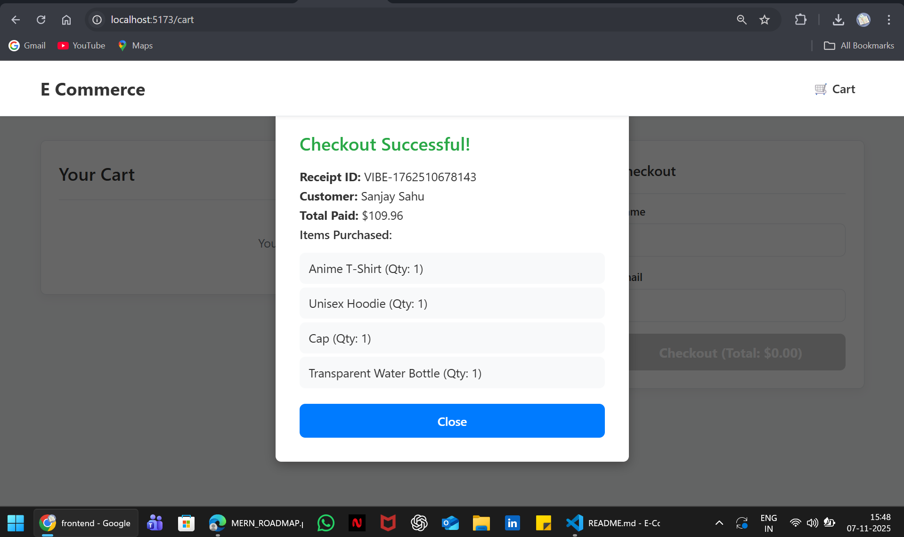

# E-Com Cart Assignment

This is a full-stack mock e-commerce shopping cart application built for the Vibe Commerce screening assignment.

## Features

* **Product Listing:** Fetches and displays a grid of mock products from the database.
* **Shopping Cart:** Full cart functionality, including adding, removing, and viewing items.
* **Dynamic Totals:** Cart total updates instantly as items are added or removed.
* **Mock Checkout:** A simple form that, upon submission, simulates a successful checkout, generates a mock receipt, and clears the cart.

## 🚀 Tech Stack

* **Frontend:** React (Vite)
* **Backend:** Node.js, Express
* **Database:** MongoDB (with Mongoose)
* **API:** REST

## Screenshots







---

## 🏃 How to Run This Project

### Prerequisites

* Node.js (v18 or later)
* MongoDB (A free MongoDB Atlas cluster)

### 1. Clone the Repository

```bash
git clone [Your-GitHub-Repo-URL]
cd vibe-commerce-cart
```

### 2. Backend Setup

```bash
# Navigate to the backend folder
cd backend

# Install dependencies
npm install

# Create a .env file in the /backend folder
# Add your MongoDB Atlas connection string
MONGO_URI=your_mongodb_connection_string_goes_here

# Start the backend server (runs on http://localhost:5001)
npm start
```

### 3. Frontend Setup

```bash
# Open a NEW terminal
# Navigate to the frontend folder
cd frontend

# Install dependencies
npm install

# Start the frontend dev server (runs on http://localhost:5173)
npm run dev
```

Open `http://localhost:5173` in your browser to use the app!

---

## Project Structure

```
vibe-commerce-cart/
├── backend/
│   ├── config/       # MongoDB connection
│   ├── controllers/  # API logic (getProducts, processCheckout, etc.)
│   ├── models/       # Mongoose schemas (Product, CartItem)
│   ├── routes/       # Express route definitions
│   └── server.js     # Main backend entry point
├── frontend/
│   ├── src/
│   │   ├── api/        # Functions to call the backend
│   │   ├── components/ # Reusable React components (ProductCard, CartView)
│   │   ├── context/    # Global CartContext
│   │   ├── pages/      # Main ShopPage
│   │   ├── App.jsx     # Main app layout
│   │   └── main.jsx    # React entry point
└── README.md
```
